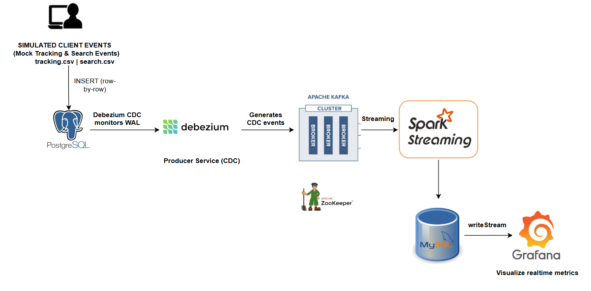
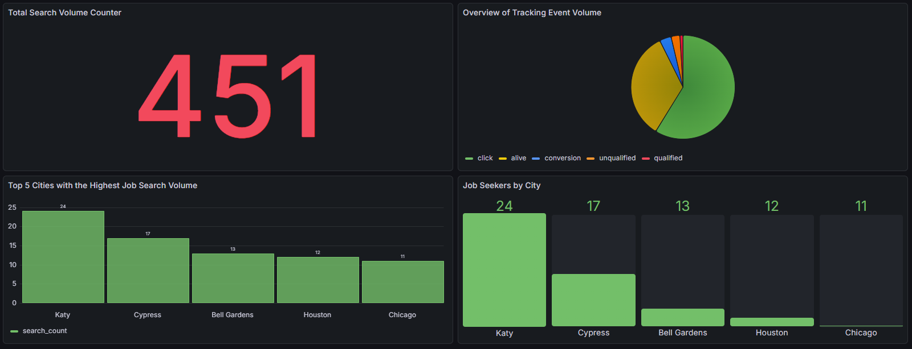

# Real-Time CDC Data Pipeline for Recruitment Analytics

An end-to-end, real-time Change Data Capture (CDC) pipeline designed to process recruitment data (job searches and user tracking events) from a source database to a visualization dashboard with millisecond latency.

---

## 1. Introduction / Overview

**What problem does this solve?**
Traditional batch ETL processes introduce high latency, making it impossible to react to user behaviors or monitor system health in real-time. This project implements a modern streaming architecture that captures row-level database changes instantly without impacting the performance of the source transactional database.

**Main Use Case:**
Simulating a recruitment platform, this pipeline tracks user job searches (search_by_jobid) and interactions (tracking_events like clicks, alive, conversion). Data is captured, cleaned, transformed, and visualized on a live dashboard.



---

## 2. Demo & Screenshots

**Architecture Flow**


**Real-Time Dashboard**



---

## 3. Installation

**Prerequisites:**
* Docker & Docker Compose
* Python 3.10+
* Java 8+ (Required for PySpark)

**Setup Steps:**
* 1.Clone the repository
* 2.Set up the Python Virtual Environment
* 3.Start the Infrastructure (PostgreSQL, MySQL, Kafka, Zookeeper, Debezium, Grafana)
    ```bash
    docker-compose up -d
    ```
## 4.Usage

To run the full pipeline, follow these steps in order:

**Step 1: Register Debezium Connector**

Initializes the CDC process to watch PostgreSQL WAL logs.
```bash
python infrastructure/register_debezium.py
```
Expected Output: Connector registered successfully!

**Step 2: Start Data Generators**

Run the scripts that simulate real-time user activity by inserting CSV data into PostgreSQL.
```bash
python scripts/load_search_to_postgres.py
python scripts/load_tracking_to_postgres.py
```

**Step 3: Start Spark Streaming Processors**

```bash
python streams/search_stream.py
python streams/tracking_stream.py
```

**Step 4: View the Dashboard**

* Open your browser and navigate to http://localhost:3000
* Login: admin / admin
* Watch the charts update automatically every 5 seconds!

---

## 5. Project Structure
```text
.
├── data/
│   ├── source/                 # Raw tracking and search CSV files
│   └── checkpoint/          # Spark Streaming checkpoint directories (auto-generated)
├── img/
├── infrastructure/
│   ├── mysql/
├   ├── postgres/   
│   └── register_debezium.py # Script to POST connector config to Debezium API
├── producers/
│   ├── load_search_to_postgres.py       # Simulates real-time search inserts to Postgres
│   └── load_tracking_to_postgres.py     # Simulates real-time tracking inserts to Postgres
├── streams/
│   ├── search_stream.py     # PySpark job for search events
│   └── tracking_stream.py   # PySpark job for tracking events
├── docker-compose.yml   # Docker services configuration
└── README.md
```

---

## 6. Tech Stack
* **Source Database:** PostgreSQL (Generates Write-Ahead Logs)
* **CDC Tool:** Debezium (PostgreSQL Connector)
* **Message Broker:** Apache Kafka & Zookeeper
* **Stream Processing:** Apache Spark (PySpark Structured Streaming)
* **Sink Database / Data Warehouse:** MySQL
* **Data Visualization:** Grafana
* **Containerization:** Docker

---

## 7. Technical Details

**Data Transformation Schema:**
Messages captured by Debezium contain complex metadata. The Spark jobs are configured to extract only the **payload.after** block and cast it to the appropriate data types before loading into MySQL.

Example Kafka JSON Payload (Abridged):

```json
{
  "payload": {
    "before": null,
    "after": {
      "job_id": "852",
      "city_name": "Ho Chi Minh",
      "pay_from": "1000"
    },
    "op": "c"
  }
}
```

**Kafka Topics Automatically Created:**

* **cdc.public.tracking_events**
* **cdc.public.search_by_jobid**

---

## 8. Author & Contact

* Phat Tran
* Email: tranvinhphat02022001@gmail.com
* Github: https://github.com/tranvinhphat0202


